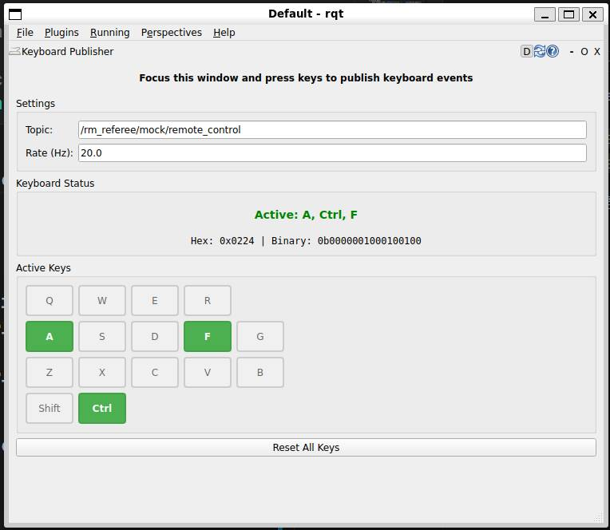
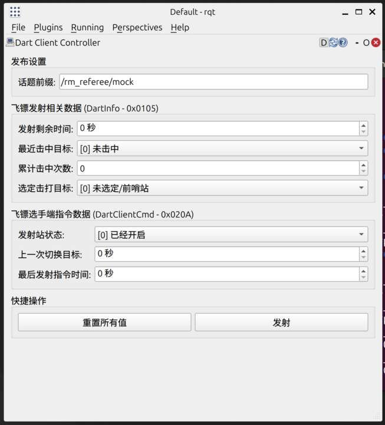
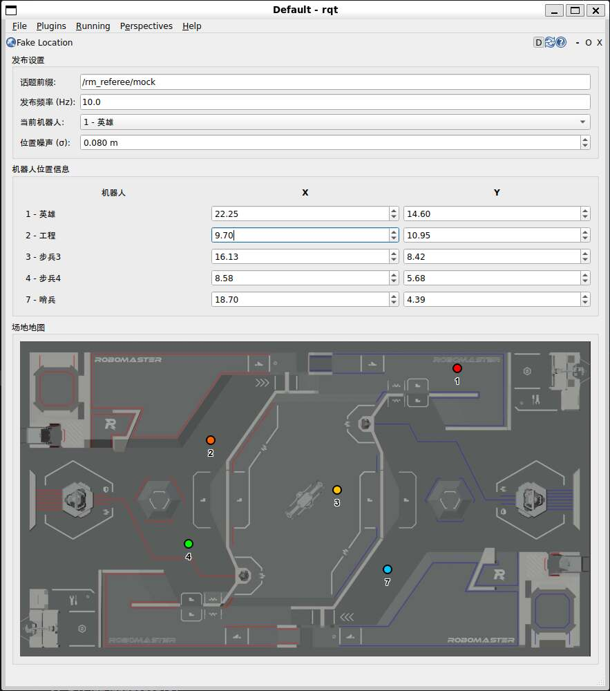
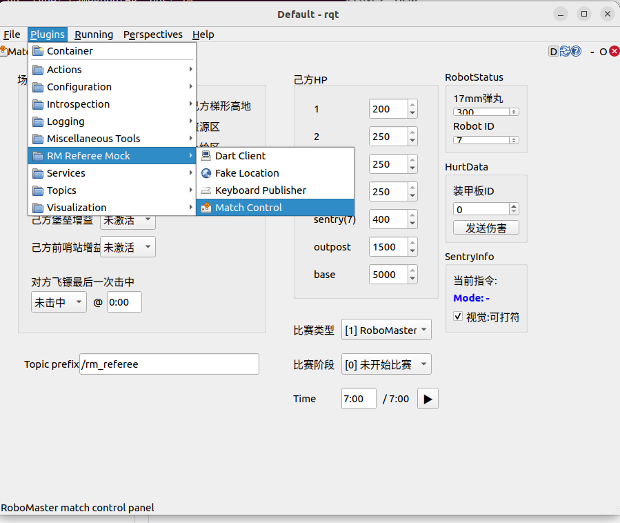

# rm_referee_mock

这是 `rm_referee_ros2` 所属的一个子模块，提供了一些用于测试的 Mock 组件，用来模拟裁判系统的数据发送行为，方便在没有真实裁判系统或者不便搭建环境的情况下进行开发和测试。

目前为止所有的 Mock 组件均以 rqt 插件的形式实现，编译并 source 工作空间后，在 rqt 中启动对应的插件即可使用。

## Keyboard Publisher

模拟图传链路的键鼠数据发送功能。Keyboard Publisher 会读取键盘输入，并将输入的数据封装成 `rm_referee_msgs/RemoteControl` 消息发布到指定话题上。

> TODO: 鼠标

## Dart Client

模拟比赛服务器下发的飞镖相关信息和云台手客户端的操作，包括：

- `0x0105` `rm_referee_msgs/DartInfo`：飞镖发射相关数据（固定以 3Hz 频率发送）
- `0x020A` `rm_referee_msgs/DartClientCmd`：飞镖选手端指令数据（固定以 3Hz 频率发送）

## Fake Location

模拟 UWB 定位数据。rqt 界面上每个小圆点代表一个机器人，拖动圆点可以改变机器人的位置，拖动圆点周围的小三角可以改变机器人的朝向。如果需要更精确的数值也可以直接直接输入位置和朝向数据。Fake Location 会根据以上数据构造发布 `rm_referee_msgs/RobotPos` 和 `rm_referee_msgs/GroundRobotPosition` 消息。另外，Fake Location 还支持给实际发布的假数据添加高斯噪声，以模拟真实环境下的定位误差。通过调整界面上的“位置噪声”参数可以控制噪声的大小。

> [!NOTE]  
> 根据裁判系统协议定义，只有“本机器人位置”(`rm_referee_msgs/RobotPos`)消息包含朝向信息。

> TODO: 通过 0x0301 多机通信消息模拟雷达发送的敌方机器人位置数据

## Match Control [WIP!]

手动控制比赛数据发布。可以控制发布的数据包括：

- `0x0001` `rm_referee_msgs/GameStatus`：比赛状态
- `0x0003` `rm_referee_msgs/GameRobotHP`：己方机器人血量
- `0x0101` `rm_referee_msgs/EventData`：场地事件数据
- `0x020D` `rm_referee_msgs/Sentryinfo`:哨兵兑换信息
- `0x0201` `rm_referee_msgs/RobotStatus`:本机器人状态
- `0x0208` `rm_referee_msgs/ProgectileAllowance`允许发弹量和剩余金币
- `0x0206` `rm_referee_msgs/HurtData`:扣血信息

可以收到的发送的数据：
- 目前只能解析哨兵发送的0x0120部分数据

如果有需要，可以扩展更多比赛状态的控制项。
